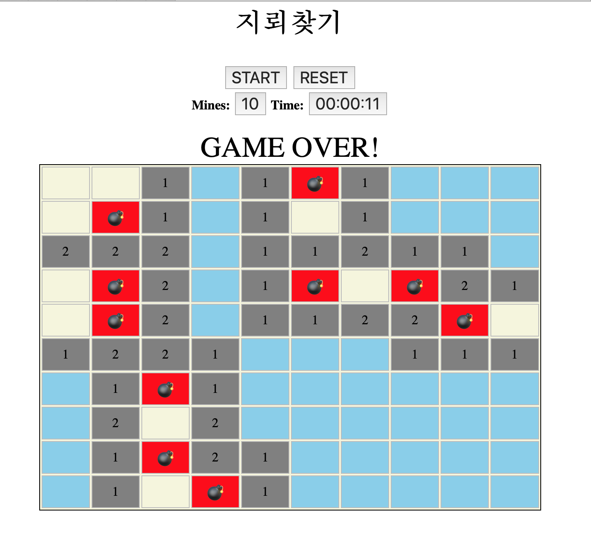

## 지뢰게임 만들기 
### html, javascript 이용 기본 지뢰게임 logic 구현 
- [x] 지뢰 크기 및 지뢰 개수 설정
- [x] 게임시간 기록 및 start and reset 기능
- [x] 선택된 cell 주변이 열리도록 구현 및 주변 폭탄 개수 기록
- [x] 폭탄 선택 혹은 선택할 cell 없는 경우 gameover   
- [ ] 깃발, 우클릭 가능하게 만들기    
- [ ] css로 파일 분리해서 중복된 style 제거     

 </img>
 </img> 
